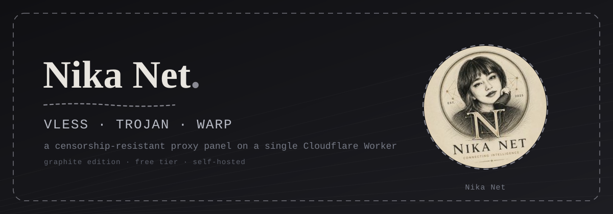

<p align="center">
  
</p>

<h1 align="center" style="font-family:Georgia,serif">Nika Net<span style="color:#8a8a93">.</span></h1>

<p align="center"><em>A pencil-drawn, censorship-resistant proxy panel — running on a single Cloudflare Worker, on the free plan.</em></p>

<p align="center">
  <a href="README.fa.md">🇮🇷 فارسی</a> &nbsp;·&nbsp;
  <a href="#-quick-start">🚀 Quick start</a> &nbsp;·&nbsp;
  <a href="#-project-structure">📁 Structure</a> &nbsp;·&nbsp;
  <a href="#-api">🔌 API</a> &nbsp;·&nbsp;
  <a href="ROADMAP.md">🗺️ Roadmap</a>
</p>

<p align="center">
  
  
  
  
  
</p>

<p align="center"></p>

<div align="center">
  <a href="https://deploy.workers.cloudflare.com/?url=https://github.com/NikaTeem/Nika-Net">
    
  </a>
</div>

---

## What is Nika Net?

**Nika Net** is a control panel and edge worker that turns your Cloudflare Worker into a censorship-resistant gateway supporting **VLESS**, **Trojan** and **WARP**. You deploy it to your **own** free Cloudflare account — the domain, the bandwidth and the data are all yours. No shared server, no middleman, no cost.

It ships with a bilingual panel (English + فارسی, RTL), a classic **graphite & pencil** theme, multi-user management, and per-user subscription links that import into almost any client.

## ✨ Features

| | |
|---|---|
| ✏️ **Graphite / paper theme** | A nostalgic, hand-drawn aesthetic — dashed pencil borders, paper grain, serif & typewriter typography, dark + light mode |
| 🌐 **Bilingual & RTL** | English and فارسی in the same panel, one click to switch |
| 👥 **Multi-user** | Per-user quota (GB), expiry (days), active/inactive, one private link each |
| 📡 **Clean-IP scanner** | In-panel radar that probes 420+ Cloudflare IPs from *your* network, ranks them by latency, and applies the best ones to every config |
| 🔌 **Multi-format configs** | Base64 (v2rayNG), Clash/Mihomo, Sing-box and WireGuard (WARP) output |
| 🛡️ **Security** | SHA-256 hashed admin password, HMAC-signed sessions, hidden admin path, camouflage for unknown routes |
| ⚡ **Serverless** | Runs entirely on the edge — free tier, auto-scaling, zero maintenance |

## 🧭 Protocols

| Protocol | Status | Notes |
|---|---|---|
| **VLESS** | ✅ | Primary — over WebSocket + TLS, `cloudflare:sockets` outbound |
| **Trojan** | ✅ | Secondary — better stealth, SHA-224 header auth |
| **WARP** | ✅ | WireGuard config export — calls (UDP) & critical situations |

> ⚠️ UDP is not carried by VLESS/Trojan on Workers (platform limitation) — use WARP for voice/video calls.

## 🚀 Quick start

```bash
# 1. clone
git clone https://github.com/NikaTeem/Nika-Net.git
cd Nika-Net

# 2. install & build
npm install
npm run build          # → dist/worker.js (single deployable file)

# 3. deploy to Cloudflare
npx wrangler login
npm run deploy
```

Then open `https://<your-worker>.workers.dev/admin`, set your admin password on first login, and you're done.

### Manual deploy (no CLI)

1. Cloudflare dashboard → Workers & Pages → **Create Worker**.
2. Paste the content of `dist/worker.js`, **Save and Deploy**.
3. *(optional)* Add a **KV namespace** bound as `NIKA_KV` — or a **D1** database as `NIKA_DB` with table `kv (key TEXT PRIMARY KEY, value TEXT)`.
4. Open `/admin`.

## 📁 Project structure

```
nika-net/
├── ui/index.html        ← panel UI (single file, no external deps, logo embedded)
├── assets/              ← logo & hero banner (docs)
├── docs/index.html      ← landing page (GitHub Pages)
├── src/
│   ├── worker.ts        ← entry: routing + API + subscriptions + camouflage
│   ├── types.ts         ← shared types
│   ├── settings.ts      ← persistence layer (D1 / KV / memory)
│   ├── auth.ts          ← SHA-256 password + HMAC-signed session
│   ├── generators.ts    ← base64 / clash / sing-box / wireguard generators
│   └── protocols/
│       ├── common.ts    ← WebSocket → TCP helpers
│       ├── vless.ts     ← VLESS-over-WebSocket handler
│       └── trojan.ts    ← Trojan-over-WebSocket handler (SHA-224)
├── scripts/build.js     ← esbuild → single dist/worker.js
├── wrangler.jsonc       ← Cloudflare config
├── package.json / tsconfig.json
├── ROADMAP.md
└── README.md / README.fa.md / LICENSE
```

## 🔌 API

| Route | Description |
|---|---|
| `/admin` | Admin panel |
| `POST /api/login` | Sign in (first call sets the password) |
| `GET /api/status` | Panel status (session required) |
| `GET/POST/DELETE /api/users` | User management |
| `GET/POST /api/settings` | Read / save settings |
| `GET /api/gen?id=<userId>` | Generate a user's configs |
| `GET /sub/<token>` | User subscription (Base64) |
| `GET /sub/<token>.yaml` | Clash subscription |
| `GET /sub/<token>.json` | Sing-box subscription |
| `GET /<uuid>` | Config fetch by user UUID |
| WS `?uuid=<u>&proto=vless\|trojan` | Proxy connection |

## 🤖 Nika Net Launcher (Telegram bot)

A companion Telegram bot, also running on Cloudflare Workers (free), that builds Nika Net panels for you — with a **direct token link** (permissions pre-selected), encrypted token storage, and one-tap panel deployment. See [bot/README.md](bot/README.md) and [bot/SETUP.fa.md](bot/SETUP.fa.md).

## 🗺️ Roadmap

Fragment (anti-DPI), ISP presets (MCI/MTN/Rightel/TCI), QR codes, Telegram bot — see [ROADMAP.md](ROADMAP.md).

## 📜 License

[MIT](LICENSE) — free for personal use and learning. Use responsibly.
